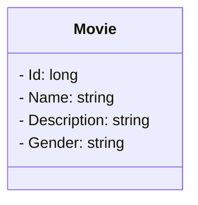

# GEM Golden Era Movie 

## Principais tecnologias
- **Java 17**
- **Spring Boot 3**
- **Spring Data JPA**
- **Spring boot validation**
- **Mysql**

O aplicativo é um projeto destinado ao cadastro de filmes, incluindo suas descrições e detalhes que você apreciou. 
  
Movie:

    Atributos: Id, Name, Description and gender.
    Funcionalidade: Realiza o cadastro de filmes que você gosta com detalhes que foram marcantes.

## Funcionalidades do Sistema

- O sistema permite operações CRUD (Create, Read, Update e Delete) para interagir com os filmes.
- Entidades sera persistida no Mysql ou no H2.
 
## Projeto em andamento sujeito a alterações.

