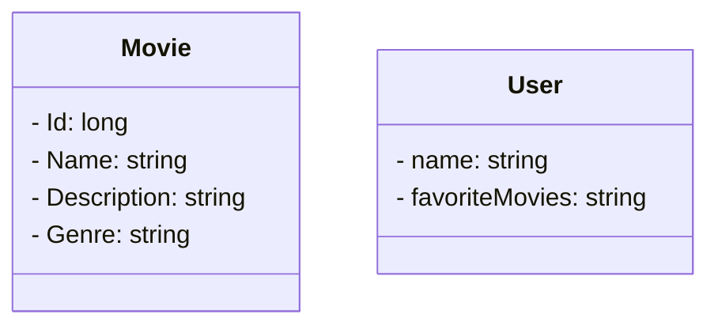

# GEM Golden Era Movie 

## Principais tecnologias
- **Java 17**
- **Spring Boot 3**
- **Spring Data JPA**
- **Spring boot validation**
- **OpenAPI (Swagger)**
- **Mysql**
-  **Docker**

O aplicativo é um projeto destinado ao cadastro de filmes, incluindo suas descrições e detalhes que você apreciou. 
  
Movie:

    Atributos: Id, Name, Description and genre.
    Funcionalidade: Realiza o cadastro de filmes que você gosta com detalhes que foram marcantes.

Usuário:

    Atributos: Name, favoriteMovies.
    Funcionalidade: Quando buscar um usuário deve vier junto a lista dos filmes favoritos dessa pessoa.

## Funcionalidades do Sistema

- O sistema permite operações CRUD (Create, Read, Update e Delete) para interagir com os filmes.
- Ambas as entidades serão persistidas no Mysql.
- Quando busca pelo user deve retornar a sua lista de movies.
- O sistema permite puxar os filmes cadastrados sem precisar buscar através do user.
 
## Projeto em andamento sujeito a alterações.

